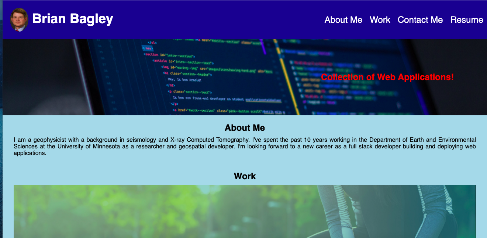

<h1 align="center">Portfolio Brian Bagley</h1>

# About Me
I am a geophysicist with a background in seismology and X-ray Computed Tomography. I've spent the
past 10 years working in the Department of Earth and Environmental Sciences at the University of 
Minnesota as a researcher and geospatial developer. I'm looking forward to a new career as a full
stack developer building and deploying web applications.

[Portfolio](https://bagl0025.github.io/portfolio/)

[Github Repository for Portfolio](https://github.com/bagl0025/portfolio.git)

